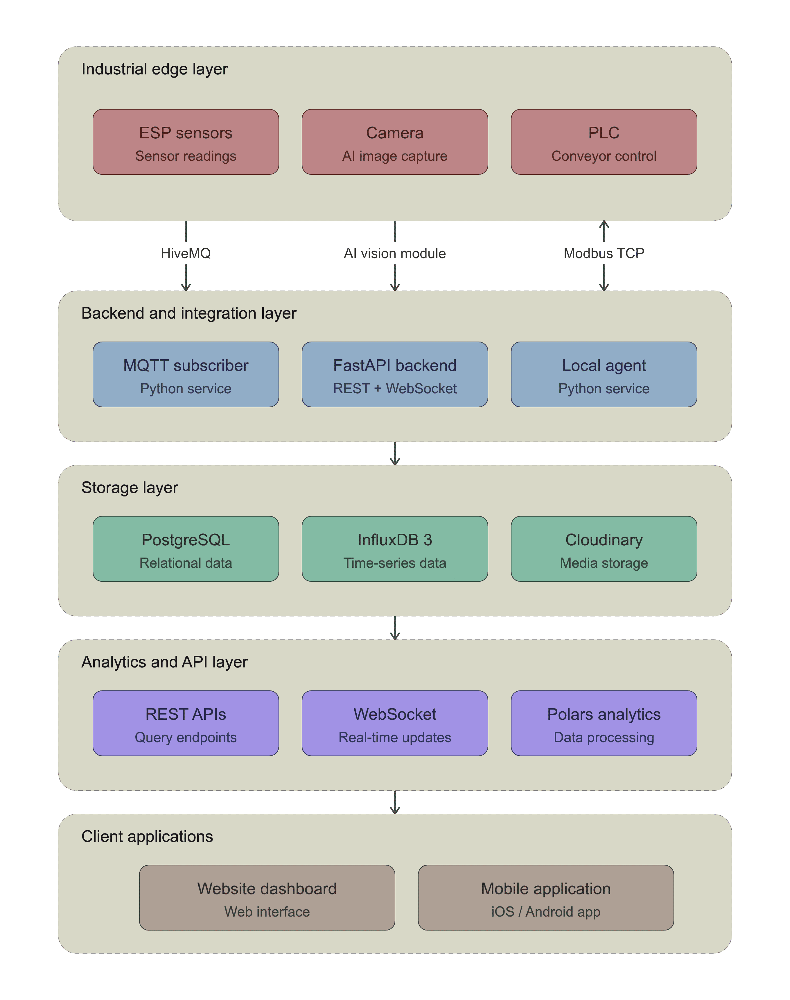

# 🏭 Nexus - Integrated Industrial IoT Platform for AI Quality Inspection

Welcome to the **Nexus** organization! 

Nexus is a comprehensive, human-in-the-loop industrial automation platform. It seamlessly integrates physical hardware, real-time AI computer vision, cloud telemetry, and interactive dashboards to orchestrate and monitor automated product sorting operations.

---

## 🏗️ System Architecture & Data Flow

Our platform is built on a highly modular, layered architecture ensuring scalability, real-time responsiveness, and secure industrial control. 

  

### 1. ⚙️ Industrial Edge & Hardware Layer
At the factory floor, the edge layer captures physical interactions and controls the sorting mechanism:
* **Sensors:** ESP-based sensors continuously read and transmit high-frequency telemetry data (current, speed, temperature, vibration).
* **Camera:** Captures real-time images of the products on the conveyor belt for AI inference.
* **PLC (Programmable Logic Controller):** Manages the physical conveyor control and executes sorting commands.

### 2. 🧠 AI Vision & Inspection Module
* **YOLO AI Model:** Analyzes captured images to detect defects instantly.
* **Human-in-the-Loop:** Predictions are categorized as *Good*, *Defected*. Low confidence images are escalated for human review, ensuring high dataset reliability and accurate quality control.

### 3. 🌉 Edge Computing & Communication
* **Local Agent:** Acts as a secure edge bridge located on the local factory network. It translates cloud commands from the **HiveMQ** broker (via MQTT over TLS) into **Modbus TCP** commands to control the PLC securely without exposing the hardware directly to the internet.

### 4. ☁️ Backend & Integration Layer
The central orchestration layer built for high-throughput and asynchronous processing:
* **FastAPI Backend:** Exposes RESTful APIs for client applications and streams live sensor data via **WebSockets**.
* **MQTT Subscriber:** A dedicated Python service that continuously ingests telemetry data from the HiveMQ broker and validates it before storage.

### 5. 🗄️ Storage & High-Performance Analytics
A dual-database strategy separates transactional workloads from high-frequency telemetry:
* **PostgreSQL:** Handles ACID-compliant relational data, including Users, Sessions, Role-Based Access Control (RBAC), Sensors, and inspection metadata.
* **InfluxDB 3:** Optimized time-series storage for continuous sensor telemetry.
* **Cloudinary:** Cloud-based media storage for managing and serving inspection images.
* **Polars Analytics:** A high-performance analytics engine that performs Time-Block Aggregation, converting millions of raw telemetry rows into contiguous machine states (RUNNING, STOPPED, ERROR, OFFLINE).

### 6. 📱 Client Applications
* **Website Dashboard:** A web interface providing administrators and operators with a comprehensive view of the timeline chart, pending inspections, and system management.
* **Mobile Application:** An iOS/Android app for on-the-go monitoring of live telemetry and machine status.

### 7. 🧪 Software Testing & Quality Assurance
Our testing scope strictly focuses on ensuring a seamless, responsive, and reliable user experience across our client applications:
* **UI/UX & Functional Testing:** Validating responsive designs, component interactions, and the accurate rendering of the human-in-the-loop review interfaces on both the Web Dashboard and Mobile App.
* **Access Control Validation:** Testing the frontend routing and state management to ensure Role-Based Access Control (RBAC) correctly restricts views and actions based on user roles (Admin, Operator, Viewer).

---

## 📂 Repository Index
Explore the subsystems that make up the Nexus platform:

* 📦 **[Backend](link-to-repo)** 
* 🧠 **[AI Computer Vision Module](link-to-repo)** 
* 🔌 **[Edge Local Agent (PLC Bridge)](link-to-repo)** 
* 💻 **[Website](link-to-repo)** 
* 📱 **[Mobile Application](link-to-repo)** 
* ⚙️ **[Hardware & Embedded Code (ESP/Sensors)](link-to-repo)** 
* 🧪 **[Software Testing & QA](link-to-repo)**

---
*Built by the Nexus Engineering Team.*

*🎓 Developed as B.Sc. Graduation Project in Computer and Systems Engineering (Class of 2026).*
